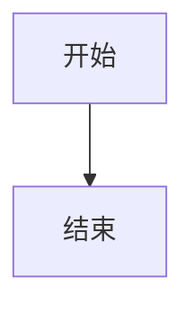

# 【前端】技术设计文档编写

## 何时使用

用户需要**前端技术设计文档**（结构与《【前端】技术设计文档示例》一致）时，先读本 Skill，再按 [reference-template.md](reference-template.md) 产出 Markdown。

## 信息来源（必须按顺序采集）

1. **项目 README**（根目录 `README.md`；若无则在文档中注明并据代码与规则推断）  
2. **项目规则**：`.cursor/rules/`、`AGENTS.md`、`.cursorrules`（存在的都读）  
3. **接口定义（§2.2.1「涉及到修改的接口」表）**  
   - 若当前会话可用 **Apifox 相关 MCP**：**必须调用** MCP 拉取与本需求相关的接口（路径、Method、参数、响应要点），填入该五列表格，并可在表前或脚注注明 Apifox 项目/环境与同步日期。细则见 [reference-apifox-mcp.md](reference-apifox-mcp.md)。  
   - 若无 Apifox MCP 或调用失败：在表下或「待确认事项」说明依据（后端文档 / 代码路径等），勿虚构字段。  
4. **用户输入**：需求背景、范围、原型与排期；缺失处「待补充」并列入待确认事项。

README 与规则冲突时，**以仓库配置与代码为准**并简短说明。

## 终端与机型兼容（与示例 §3.1 对齐）

模板 **§3.1** 第 1 条已固定句式：「机型兼容写法：适配IOS13以上与安卓8以上，平板与手机机型」。编写时**不得删省**，并可在正文展开横竖屏、安全区、分栏等。若需在 **§1.4.2** 非功能中增加一条「终端与兼容见 3.1」亦可。

## 默认输出位置与命名

| 项 | 规则 |
|----|------|
| 需求文档根 | `docs/general/{需求名称}/`（结构见 [docs/README.md](../../docs/README.md)；不存在则先从 `docs/_template/` 复制） |
| 设计文档路径 | `docs/general/{需求名称}/技术设计方案/{需求名称}前端技术设计文档.md` |
| **编码提示词路径** | `docs/general/{需求名称}/coding-plan/{需求名称}-coding.md`（每次产出技术设计时**必须**写入） |
| 需求名称 | 去非法字符、首尾空格，与目录名一致 |

用户要求其它路径时从其约定。重名可用 `-v2` 等后缀并在回复说明。

## 文档结构（对齐《【前端】技术设计文档示例》）

完整骨架见 [reference-template.md](reference-template.md)。**一级章节为 §1～§5**：

| 章节 | 要点 |
|------|------|
| **1. 需求概述** | 1.1 需求背景；两个 **#### 1.3**（用户故事、目标）；1.4 梳理含 1.4.1 功能 / 1.4.2 非功能（条目与模板一致，可按需追加） |
| **2. 技术方案** | 2.1 技术选型（含 2.1.1、2.1.2、2.1.6 等，与模板同级结构）；**2.2 功能开发方案实现**（含 **#### 2.2.1**，其下 **#####** 流程图说明、代码目录设计、**涉及到修改的接口（Apifox MCP）**、具体代码实现）；**### 2.3风险评估**；**### 2.4 影响范围** |
| **3. 设计方案** | 3.1 用户界面设计（含机型兼容第 1 条、组件封装）；3.2 用户体验设计 |
| **4.时间评估** | 表格：模块 / 子模块 / 优先级 / 工时 / 负责人 |
| **5. 附件** | 相关文档、界面原型、其他附件 |

小节编号与层级以 reference-template 为准（含两个 **#### 1.3**）。无图处用文字简述即可。

## 流程图（Mermaid）输出规范

- 凡在文档中**输出流程图**（以及时序图、状态图等由 Mermaid 表达的图），**一律**写入 Markdown **围栏代码块**（fenced code block），语言标识**必须为** `mermaid`，勿将 Mermaid 源码混在普通段落里。
- 示例：

````markdown

````

- **§2.2.1「##### 流程图说明」** 下：有图则放 `mermaid` 代码块；无图则写「本次无需流程图」等一句即可，勿留空标题。
- 若另存 `docs/diagrams/*.mmd` 或用工具导出 SVG，正文**仍建议**在同一小节嵌入 `mermaid` 代码块（或与 SVG 二选一并在小节内说明引用关系），保证技术设计文档单文件可读。

## 可直接使用的提示词

见 [prompt-templates.md](prompt-templates.md)。

## 交付物：正文 + 编码阶段提示词

1. **必须落盘**：`docs/general/{需求名称}/coding-plan/{需求名称}-coding.md`，内容为 [prompt-templates.md](prompt-templates.md) **模板四**（已据实填写）：设计文档相对路径、§2.2.1 接口表要点、§2.4、§3、§4、本次范围与待确认项。文件头部可用简短 HTML 注释说明生成日期与对应设计文档名（可选）。
2. **编码提示词不得写入**设计文档正文（`技术设计方案/{需求名称}前端技术设计文档.md`）。  
3. **建议**：同一条回复末尾仍附 **「编码阶段提示词（可直接复制）」** 围栏代码块，与 `-coding.md` 内正文一致，便于会话内一键复制（用户明确不要对话重复时除外）。

## 写作流程（建议）

1. 确认需求名与落盘路径；读 README 与规则。  
2. 若有 Apifox MCP：在撰写 **§2.2.1「涉及到修改的接口」** 表前调用 MCP 拉取接口。  
3. 按 [reference-template.md](reference-template.md) 填满 **§1～§5**；**§3.1 第 1 条**保留机型兼容表述。  
4. 复杂流程在 **§2.2.1 流程图说明** 中用 **mermaid 围栏代码块**作图；无流程则文字说明；§3.2 按功能写清操作与体验。  
5. 文末可列「待确认事项」。  
6. 生成编码阶段提示词（模板四），**写入** `docs/general/{需求名称}/coding-plan/{需求名称}-coding.md`，并在回复中按需附带同内容代码块。

## 质量自检

- [ ] 一级章节为 **1～5**，与 reference-template 一致（含两个 #### 1.3）  
- [ ] §3.1 含 **iOS13+、Android8+、平板与手机** 兼容表述  
- [ ] §2.2.1 接口五列表与 MCP/后端一致或已标注待确认  
- [ ] 已写入 `docs/general/{需求名称}/coding-plan/{需求名称}-coding.md`（编码阶段提示词，用户不要交付物时除外）
- [ ] 已写入 `docs/general/{需求名称}/技术设计方案/{需求名称}前端技术设计文档.md`（或用户指定路径）
- [ ] 若有流程图，已置于 **mermaid 围栏代码块**内，且与 §2.2.1 对齐
