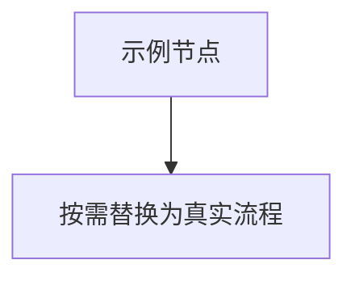

# 【前端】{需求名称}技术设计文档

版本：Vx.x.x

负责人：（姓名）

版本记录：

| 版本号 | 日期 | 审核人 | 审核结果 | 方案链接 |
| --- | --- | --- | --- | --- |
| v1.0.0 | YYYY-MM-DD | - | - | - |

## 1. 需求概述

#### 1.1 需求背景

需求文档 或者说明需求来源

#### 1.3 用户故事

暂无

#### 1.3 目标

本次需求目标

#### 1.4 需求梳理

##### 1.4.1 功能需求

* （按模块列出功能点，可多级缩进）

##### 1.4.2 非功能需求

* 基础框架搭设
* loading加载
* 上拉刷新、下拉加载
* 数据存储与公共参数

## 2. 技术方案

描述技术选型的理由和依据以及具体功能的实现方案

### 2.1 技术选型

#### 2.1.1 基础框架选型

* （如 UNI-APP / Vue3 等）

#### 2.1.2 UI框架选型

* （UI 库说明）
* （可配图）

#### 2.1.6 二次封装

* 请求
  * （如：使用原生 uni.request 进行接口请求以及拦截）
  * （可配图）
* 加密解密
  * （如：依赖 crypto-js 封装 sha 格式加密）

### 2.2 功能开发方案实现

概述对复杂需求相应的设计逻辑，并给出包括但不限于（类图，时序图，流程图，思维导图）

**基础功能按照开发规范进行开发、以下罗列一些特殊或者复杂功能的实现思路与方案**

#### 2.2.1 功能1 说明

##### 流程图说明

必要时用 Mermaid 描述流程；**有图则必须使用 `mermaid` 语言标识的围栏代码块**（无图可写「本次无需流程图」）。



##### 代码目录设计

```javascript
项目根/
├── src/
│   └── …
└── …
```

##### 涉及到修改的接口 从通过MCP工具 apifox获取接口信息

| **接口名称:请求方式** | **输入参数** | **输出结果(体现变动点)** | **应用场景** | 是否新增接口 |
| --- | --- | --- | --- | --- |
| get<br>/api/example | … | … | … | 否 |

##### 具体代码实现

1. （实现要点一）
   1. （子步骤）
      ```javascript
      // 关键代码示例
      ```
   2. （子步骤说明）

```javascript
// 补充代码块（如样式变量等）
```

### 2.3风险评估

说明本次需求可能会遇到的问题以及风险点

### 2.4 影响范围

说明本次开发影响范围

## 3. 设计方案

### 3.1 用户界面设计

展示关键界面的原型设计。

对关键界面实现的方案进行阐述，罗列可使用的通用组件或需要进行编写的通用组件。

1、机型兼容写法：适配IOS13以上与安卓8以上，平板与手机机型

2、组件封装

### 3.2 用户体验设计

确保用户体验，是否可以在某些界面元素，过渡，变换，跳转过程中恰当使用动画，达成交互体验佳的体感。

前言：用户体验设计与优化体现在很多方面、并且每个人的审美与想法都各不相同。故需要集思广益达到大家都满意

2、功能操作以及体验设计

* （页面或功能点）
  * （交互与提示说明）

## 4.时间评估

| 模块 | 子模块 | 优先级 | 工时（小时） | 负责人 |
| --- | --- | --- | --- | --- |
|  |  | P0 |  |  |
| 合计 |  |  |  |  |

## 5. 附件

* **相关文档**：（相关文档链接）
* **界面原型**：（界面原型链接）
* **其他附件**：（其他相关附件链接）
