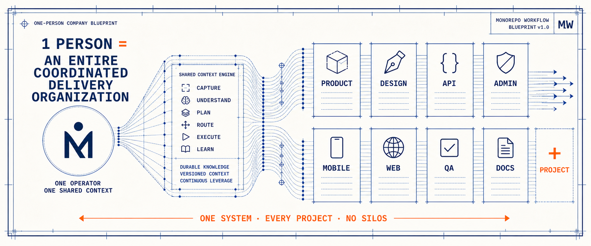

<div align="center">
  <h1>Monorepo Workflow</h1>
  <p><strong>一个人，打通公司的全部项目。</strong></p>
  <p>让产品、设计、后端、前端、测试、评审和文档在同一套 AI 协作系统中持续交付，告别项目隔阂。</p>
  <p><code>1 位操作者 × 共享上下文 × 专业 Agents = 公司级交付能力</code></p>
  <p>
    <a href="https://github.com/rx-chenxiang/monorepo-workflow/actions/workflows/ci.yml"></a>
    <a href="./LICENSE"></a>
  </p>
  <p>
    <a href="./README.md">English</a> ·
    <a href="#30-秒开始">快速开始</a> ·
    <a href="./docs/guides/workspace-architecture.md">工作区架构</a> ·
    <a href="./CONTRIBUTING.md">参与贡献</a>
  </p>
  <p><strong>快速开始：</strong><code>git clone https://github.com/rx-chenxiang/monorepo-workflow.git</code></p>
</div>



## 30 秒开始

```bash
git clone https://github.com/rx-chenxiang/monorepo-workflow.git
cd monorepo-workflow

# 验证工作区
bash tests/pull_repos_test.sh
python3 scripts/check_markdown_links.py
```

然后在 [`repos.conf`](./repos.conf) 中配置真实仓库，先预览范围，再执行拉取或更新：

```bash
./pull_repos.sh --workspace general --list
```

完整接入流程见[快速开始指南](./docs/guides/quick-start.md)。

## 它解决什么问题

大多数 AI 编码方案都停留在单个仓库中。每切换一个项目，就要重新解释背景、重复架构决策、重新连接需求，并在人、Agent、后端、前端、测试和文档之间手工传递信息。

Monorepo Workflow 在所有业务仓库之上增加统一协作层：

```text
想法 → 需求 → 设计 → 计划 → 开发 → 测试 → 评审 → 文档 → 持续改进
```

一个人掌握目标，专业 Agent 承担不同角色，路由规则把任务送到正确项目，长期文档把知识留给下一次开发。

## 它和同类方案有什么不同

| 常见的逐仓库 AI 开发 | Monorepo Workflow |
|---|---|
| 切换仓库就丢失上下文 | 共享需求、接口契约、决策和项目知识 |
| 每次靠提示词临时判断改哪里 | 修改前先执行“工作角色 × 项目范围”路由 |
| Monorepo 意味着所有源码必须共用 Git 历史 | 用协调根仓统一治理多个独立业务仓库 |
| 前端容易长期依赖本地 Mock | API 优先，所有客户端对齐真实后端契约 |
| 交接后设计依据和实现知识消失 | 交付文档与长期项目文档分别沉淀 |
| 新增项目就重新发明一套流程 | 注册新项目或项目组，继续复用原有流程 |

它不是一组“聪明提示词”，而是一套可以版本化维护的公司级协作方式：让人和 Agent 知道如何理解、修改、验证并记住跨项目工作。

## 一个人覆盖完整开发流程

| 阶段 | 已具备的能力 |
|---|---|
| 发现 | 将口头想法、PRD、截图和原始需求整理成结构化方案 |
| 设计 | 生成 UI 方向、交互原型、技术设计和编码前置摘要 |
| 开发 | 将后端、管理平台、移动端、官网或未来项目路由到正确上下文 |
| 验证 | 执行代码评审、安全评审、功能测试、Playwright E2E 和验收流程 |
| 记忆 | 沉淀需求、决策、模块知识、回归经验和变更记录 |
| 运维协作 | 预览、拉取、更新并协调多个仓库，不合并它们的 Git 历史 |

当前仓库内置 **12 个专业 Agents、10 个可复用 Skills、11 条路由与工作流规则**，帮助独立开发者或小型技术团队覆盖原本分散在多个岗位中的研发流程。

## 不止四个项目

默认注册表提供一个后端和三个客户端作为起点：

```text
api · fornt_admin · m_front · pc_fornt
```

这是起步拓扑，不是能力上限。`repos.conf` 支持多个工作区分组和任意项目 ID；路由注册表、项目级 `AGENTS.md` 与文档索引也可以继续扩展，用于更多服务端、客户端、内部工具、数据项目、自动化仓库或独立产品线。

```text
统一协作层
├── 产品组 A
│   ├── api
│   ├── admin
│   └── mobile
├── 产品组 B
│   ├── service
│   └── website
└── 内部系统
    ├── data
    ├── automation
    └── operations
```

扩展方式见[工作区架构](./docs/guides/workspace-architecture.md)。

## 系统如何运转

```text
你的需求
    ↓
识别角色：产品 / 设计 / 后端 / 前端 / QA / 评审 / 文档
    ↓
识别范围：单个项目 / 一个项目组 / 公司级范围
    ↓
加载上下文：AGENTS.md → 文档索引 → 模块知识 → 真实代码
    ↓
实现与验证
    ↓
将知识留给下一次任务
```

五条核心约束保证系统不会失控：

1. 只有一个权威项目路由注册表。
2. 使用真实后端契约，不以 Mock 代替联调。
3. 一次需求的交付资料与项目长期知识分开维护。
4. 各业务仓库继续保留独立版本历史。
5. 每次实现都以匹配风险的验证和文档沉淀收尾。

## 工作区结构

```text
monorepo-workflow/
├── AGENTS.md              # 公司级路由与安全变更边界
├── .codex/                # Rules、Agents、Skills 的权威来源
├── .cursor/               # 生成的兼容镜像
├── api/                   # 默认后端项目上下文
├── fornt_admin/           # 默认管理平台项目上下文
├── m_front/               # 默认移动 / H5 项目上下文
├── pc_fornt/              # 默认 PC 官网项目上下文
├── docs/
│   ├── guides/            # 公开使用与架构指南
│   ├── general/           # 跨项目需求交付资料
│   └── _template/         # 新需求文档骨架
├── scripts/               # 维护和验证脚本
└── tests/                 # 回归检查
```

真实业务源码可以继续放在不同 Git 仓库中；根仓库只维护跨仓库协作系统，以及运行这套系统所需的知识。

## 文档导航

| 目标 | 从这里开始 |
|---|---|
| 接入已有业务仓库 | [快速开始](./docs/guides/quick-start.md) |
| 配置项目组与仓库来源 | [仓库配置](./docs/guides/repository-configuration.md) |
| 理解人和 Agent 如何协作 | [Agent 工作流](./docs/guides/agent-workflow.md) |
| 增加项目或理解所有权边界 | [工作区架构](./docs/guides/workspace-architecture.md) |
| 新建跨项目需求 | [文档中心](./docs/README.md) |
| 扩展 Codex / Cursor 配置 | [.codex 说明](./.codex/README.md) |
| 准备公开发布 | [开源发布检查清单](./docs/guides/open-source-release-checklist.md) |

## 三种使用方式

| 方式 | 适合场景 |
|---|---|
| 直接采用完整模板 | 独立开发者或小团队启动多项目产品 |
| 接入已有独立仓库 | 公司已有相互隔离的后端、前端或服务仓库 |
| 只采用协作模型 | 已有 Monorepo，只需要路由、文档与验证规范 |

不要在同一工具中重复安装多份相同规则或 Skills。应确定唯一权威来源，并说明哪些目录由同步生成。

## 验证

```bash
bash tests/pull_repos_test.sh
python3 scripts/check_markdown_links.py
```

GitHub Actions 会执行相同的[基础检查](./.github/workflows/ci.yml)。

## 项目状态

当前项目提供协调层、仓库工具、文档体系和 Codex / Cursor 工作流资产；它不会替你生成完整业务应用，也不会自动部署生产服务。

重要变更见 [CHANGELOG.md](./CHANGELOG.md)，首发前待处理事项见[开源发布检查清单](./docs/guides/open-source-release-checklist.md)。

## 社区协作

欢迎提交 Issue 和 Pull Request。参与前请阅读[贡献指南](./CONTRIBUTING.md)和[行为准则](./CODE_OF_CONDUCT.md)。安全漏洞请按[安全策略](./SECURITY.md)私下报告，不要创建公开 Issue。

## 许可证

本仓库原创内容采用 [MIT License](./LICENSE)。内置或改编的第三方组件继续遵循原始条款，详见 [THIRD_PARTY_NOTICES.md](./THIRD_PARTY_NOTICES.md)。
